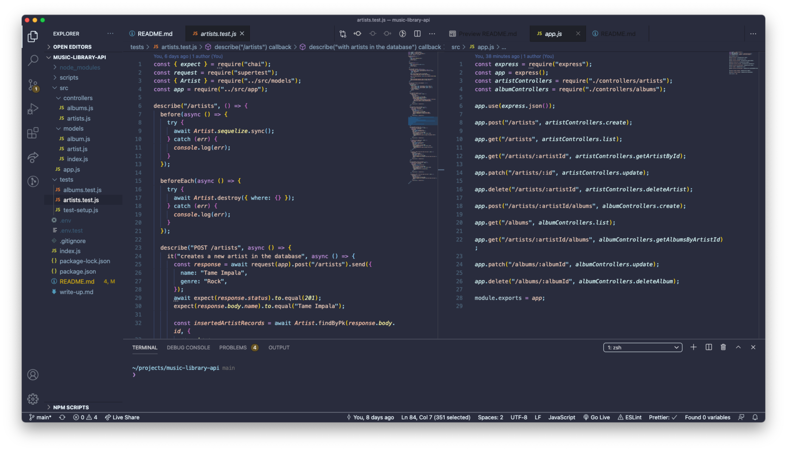
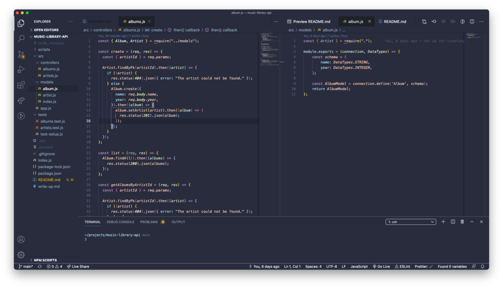
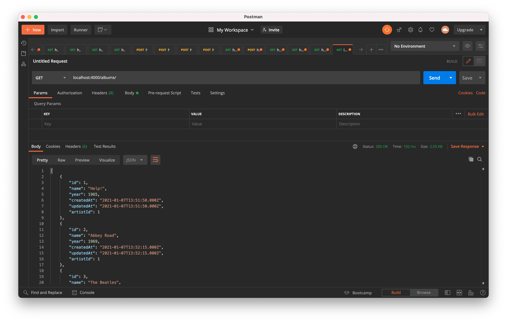

# Music Library API

A music library API, built with Express, Node.js, Sequelize and MySQL. A Manchester Codes bootcamp project.

## Table of contents

- [General info](#general-info)
- [Screenshots](#screenshots)
- [Concepts](#concepts)
- [Technologies](#technologies)
- [Languages](#languages)
- [Features](#features)
- [Status](#status)
- [Inspiration](#inspiration)
- [Contact](#contact)

## General info

This music library REST API project consists of a MySQL relational database, with tables containing information about music artists, albums and songs, and a REST API for interacting with the database to perform CRUD (create, read, update, delete) operations. The API itself has been built using Express and it uses the Sequelize Object Relational Mapper (ORM) to interact with the MySQL database.

Using the API, the user can send HTTP requests to perform CRUD (create, read, update, delete) actions on the music library database.

The API was created using Test Driven Development methodology, using Mocha, Chai and Supertest for automated testing. Postman was also used for testing during development, in conjunction with MySQL Workbench.

In addition, Docker was used as a system-agnostic environment in which to create and run the MySQL database locally. Dotenv was used to handle the environment variables and Nodemon was used during development as a useful tool to refresh the app after making changes to the Express app.

## Screenshots

## Concepts

This API was created as part of the Manchester Codes Software Engineering course. The project covered the following concepts:

- Databases & database design
- Data schema
- SQL
- MySQL
- Sequelize
- Database querying and CRUD operations
- Test Driven Development(TDD)

## Technologies

- Express
- Sequelize
- MySQL & MySQL Workbench
- Mocha, Chai and SuperTest
- Docker
- Node.js and Node Package Manager
- Git & GitHub
- Dotenv
- Nodemon
- Postman

## Languages

- JavaScript
- SQL

## Features

The API has the following functionality:

- Create new artists, albums or songs
- Get a list of all artists, all albums or all songs in the database
- Query the data to retrieve specific artists, or albums/songs by specific artists, or even individual albums or songs
- Update artist, album or song records in the database
- Delete artist, album or song records from the database

## Status

Project is: _in progress_

## Inspiration

Project created as part of Manchester Codes Full Stack Engineer bootcamp course.

An extra thank you to [Rita Łyczywek](https://www.flynerd.pl/) for this excellent README template

## Contact

Created by [@jlopenshaw](https://twitter.com/Jlopenshaw) - feel free to contact me about the project
